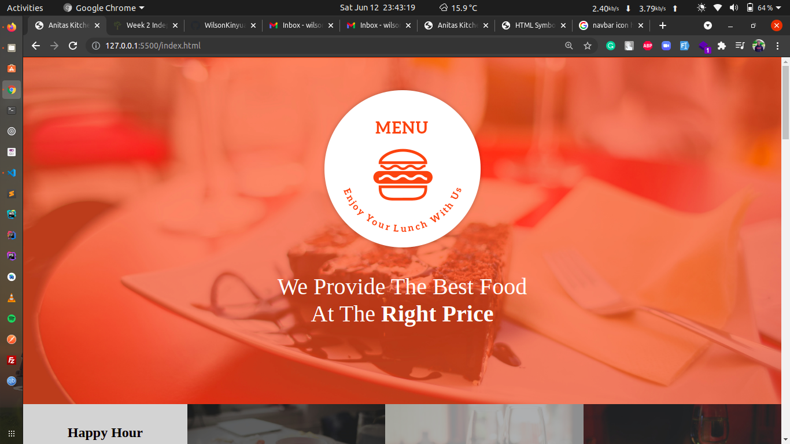
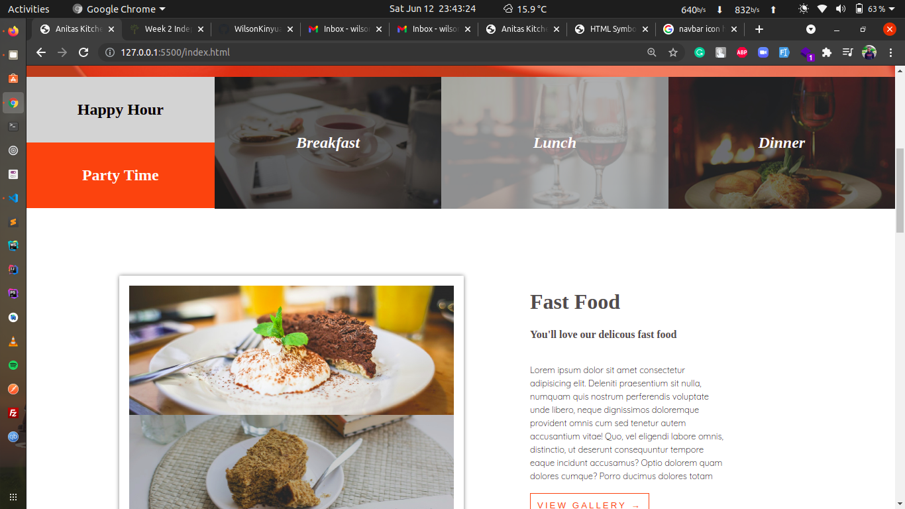
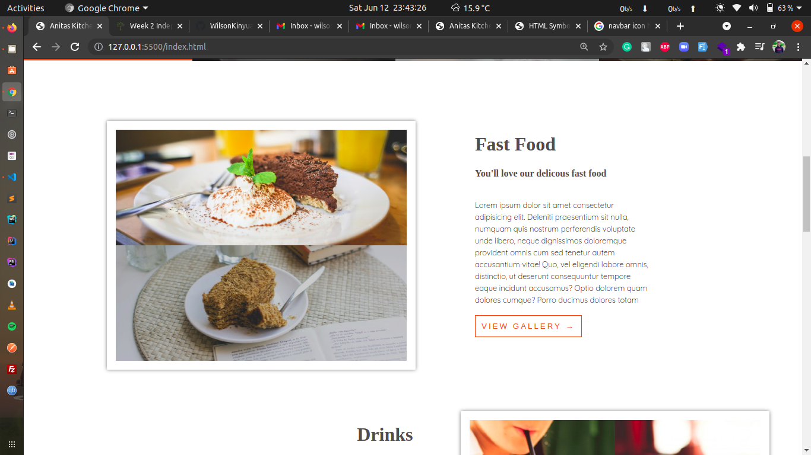
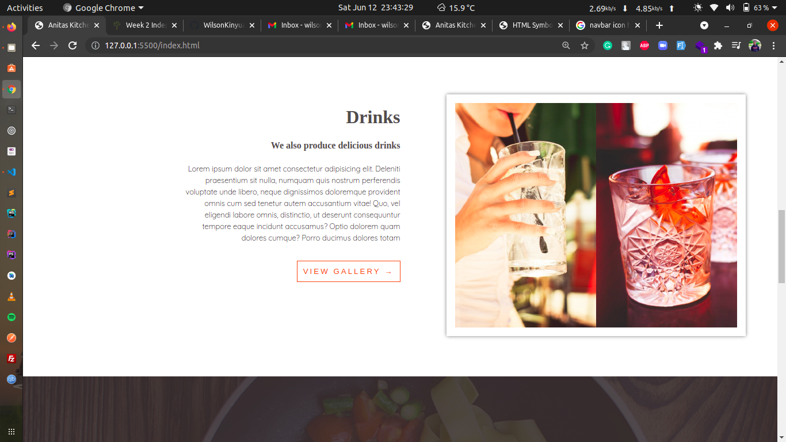
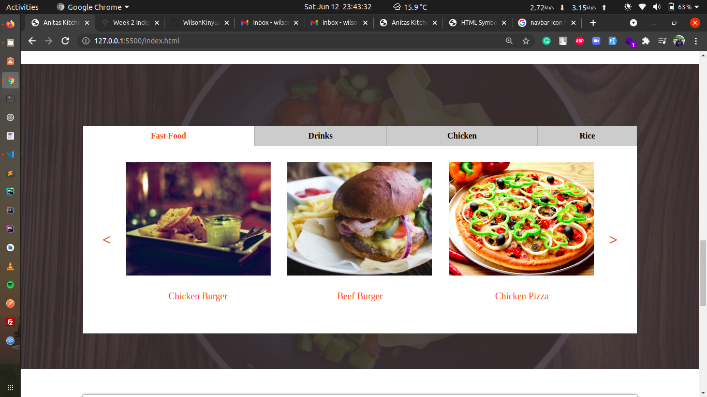

# Anitas Kitchen
#### Landing page of a restaurants website
#### Created By Wilson Kinyua Muthoni on 11-06-2021
## Description
Week 2 Independent Project | Anitas Kitchen at Moringa School. Its a site where I give details about a Restaurant named Anitas Kitchen.
## Setup/Installation Requirements
* Git
* Web-browser or your choice
* Github
## Technologies Used
 The following languages have been used on this project:
 * HTML
 * CSS

## Setup/Installation Requirements

* Live link to view the project <a href="https://wilsonkinyua.github.io/anitas-kitchen/">View Anitas Kitchen</a>
## Some Screenshots

## Known Bugs
 So far so good there are no bugs related to this project 😎
## Support and contact details 🙂
To make a contribution to the code used or any suggestions you can click on the contact link and email me your suggestions.
* Email: wilson@developerwilson.com
* Phone: +254717255460
## License
* MIT licence Copyright (c) 2021 Moringa school.
  